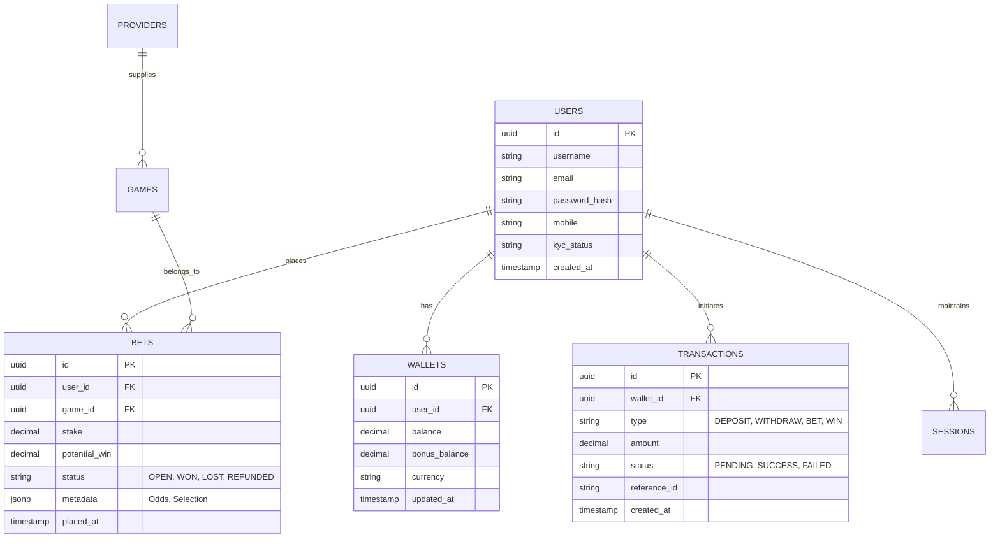
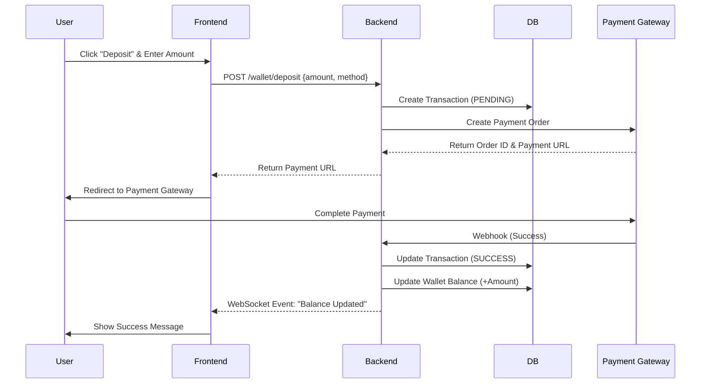
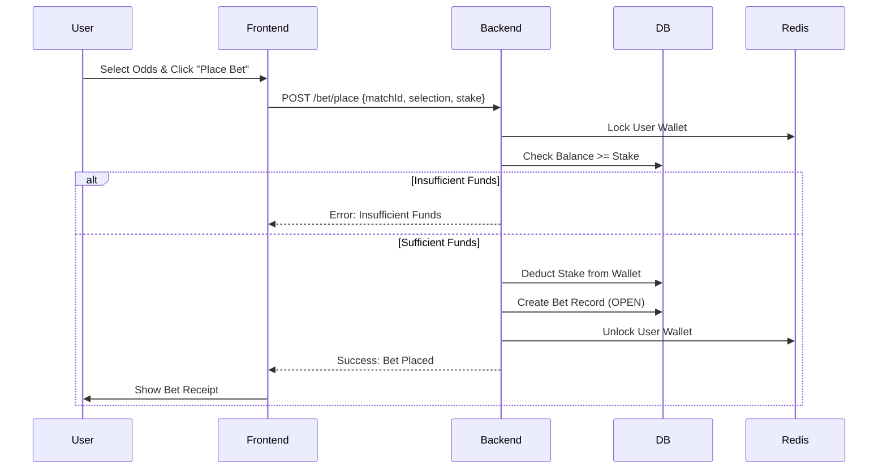

# Product Requirements Document (PRD)
## Real-Money Gaming Platform (PlayKaro Clone)

**Version:** 2.0
**Date:** November 2025
**Status:** Draft

---

## 1. Executive Summary
This document outlines the detailed requirements for building a comprehensive Real-Money Gaming (RMG) platform, modeled after `playkaro365.com`. The platform will offer a wide range of games including Sportsbook, Live Casino, Slots, and Exchange, targeting the Indian and Southeast Asian markets. The system aims for high performance, security, and a premium user experience.

## 2. Product Scope & Features

### 2.1 Core Features
*   **User Management:** Secure registration, login (Social & Standard), KYC verification, and profile management.
*   **Wallet System:** Multi-currency support (primarily INR), seamless deposits (UPI, Net Banking), and automated withdrawals.
*   **Game Library:**
    *   **Sportsbook:** Pre-match and live betting on major sports (Cricket, Football, Tennis).
    *   **Exchange:** Peer-to-peer betting exchange.
    *   **Live Casino:** Integration with providers like Evolution, Ezugi (Roulette, Blackjack, Baccarat).
    *   **Slots:** Wide variety of slot games.
    *   **Tournaments:** Scheduled competitions with leaderboards.
*   **Promotions:** Welcome bonuses, referral systems, and loyalty tiers.

### 2.2 Target Audience
*   **Primary:** Mobile-first users in India/SEA, aged 18-45.
*   **Secondary:** Desktop users for professional exchange betting.

---

## 3. Frontend Requirements (In-Depth)

### 3.1 Tech Stack
*   **Framework:** React.js (or Next.js for SEO/SSR benefits).
*   **State Management:** Redux Toolkit or Zustand (for complex game state).
*   **Styling:** Tailwind CSS (for rapid, responsive design) with a custom dark-mode theme.
*   **Real-time:** Socket.io-client for live odds and game updates.

### 3.2 UI/UX Design Principles
*   **Theme:** Premium Dark Mode (Black/Gold/Deep Blue accents) similar to PlayKaro.
*   **Navigation:**
    *   **Mobile:** Bottom navigation bar (Home, Sports, Casino, Wallet, Profile).
    *   **Desktop:** Top sticky header with mega-menus for game categories.
*   **Responsiveness:** Mobile-first approach; critical for the target market.

### 3.3 Key Pages & Components

#### 3.3.1 Landing Page (Home)
*   **Hero Carousel:** Promoting top events (IPL, World Cup) and welcome bonuses.
*   **Live Ticker:** Scrolling ticker for latest winners or news.
*   **Game Categories Grid:** Quick access icons for Exchange, Sportsbook, Live Casino, Slots.
*   **Live Events Widget:** Real-time score and odds for currently active matches.

#### 3.3.2 Authentication (Auth)
*   **Sign Up Modal/Page:**
    *   Fields: Username, Email, Password, Mobile Number (+91 prefix hardcoded/default).
    *   Social Login: Google, Facebook integration.
    *   Validation: Real-time validation for password strength and existing user checks.
    *   OTP Verification: Mobile number verification step.
*   **Login Modal/Page:**
    *   Username/Mobile & Password.
    *   "Forgot Password" flow via OTP.

#### 3.3.3 Sportsbook & Exchange Interface
*   **Layout:** 3-column layout (Leagues/Sports List -> Match Odds/Markets -> Bet Slip).
*   **Bet Slip:** Sticky component (bottom on mobile, right on desktop) showing selected bets, stake input, and potential return.
*   **Odds Display:** Dynamic updating of odds with visual indicators (Green flash for up, Red flash for down).

#### 3.3.4 Casino & Slots Lobby
*   **Filters:** Filter by Provider (Evolution, Pragmatic), Game Type (Table, Slot), Popularity.
*   **Game Launcher:** Iframe integration for third-party game providers, handling seamless wallet transactions.

#### 3.3.5 User Dashboard
*   **Wallet:** Deposit (Payment Gateway integration), Withdraw (Bank details form), Transaction History.
*   **Bet History:** Open bets, Settled bets (Won/Lost), Profit/Loss summary.
*   **Account Settings:** Password change, KYC document upload.

---

## 4. Backend Requirements (In-Depth)

### 4.1 Tech Stack
*   **Language:** Go (Golang) for high concurrency and performance.
*   **Framework:** Gin or Echo.
*   **Database:**
    *   **Primary (Relational):** PostgreSQL (User data, Wallets, Transactions).
    *   **Caching/Session:** DragonflyDB (High-performance Redis alternative).
    *   **TimeSeries (Optional):** InfluxDB for logging betting trends/analytics.
*   **Message Queue:** Redis Pub/Sub (via DragonflyDB) for real-time events.

### 4.2 API Architecture
*   **RESTful API:** For standard CRUD operations (User, Wallet, History).
*   **GraphQL API:** Single endpoint `/query` for flexible, efficient data fetching.
*   **WebSocket Server:** For real-time features:
    *   Pushing live odds updates to clients (via Redis Pub/Sub).
    *   Global Chat and User Notifications.

### 4.3 Key Modules

#### 4.3.1 User Management Service
*   **Auth:** JWT (JSON Web Tokens) based authentication. Refresh token rotation.
*   **RBAC:** Role-Based Access Control (User, Agent, Admin, Super Admin).
*   **KYC:** Integration with third-party KYC providers (OCR for ID cards) or manual admin review workflow.

#### 4.3.2 Wallet & Transaction Service
*   **Ledger:** Double-entry bookkeeping system to ensure data integrity.
*   **Payment Gateways:** Integration with aggregators supporting UPI, Netbanking, Credit Cards.
*   **Withdrawals:** Automated payouts via Payout APIs (RazorpayX, Cashfree) or manual approval queue for large amounts.
*   **Concurrency:** Optimistic locking to prevent race conditions on balance updates.

#### 4.3.3 Betting Engine
*   **Odds Feed:** Integration with external sports data providers (e.g., BetRadar, Sportradar) via API/WebSockets.
*   **Bet Placement:**
    *   Validation: Check balance, bet limits, market status (Open/Suspended).
    *   Execution: Deduct stake, create bet record.
*   **Settlement:** Automated settlement based on match results from data provider.

#### 4.3.4 Game Provider Integration (Casino/Slots)
*   **Seamless Wallet API:** Implement standard "Seamless Wallet" protocol:
    *   `GetBalance`: Provider asks for user balance.
    *   `Debit`: Provider deducts bet amount.
    *   `Credit`: Provider adds win amount.
    *   `Rollback`: Handle cancelled rounds.

#### 4.3.5 Admin Panel (Back-Office)
*   **Dashboard:** Real-time GGR (Gross Gaming Revenue), Active Users, Liability monitoring.
*   **User Management:** Ban/Unban users, View betting history, Adjust balances (with audit log).
*   **Risk Management:** Set bet limits per sport/category, Flag suspicious accounts.
*   **CMS:** Manage banners, promotions, and announcements.

---

## 5. Detailed Technical Specifications

### 5.1 Database Schema (PostgreSQL)

#### 5.1.1 Entity Relationship Diagram (ERD)


#### 5.1.2 Key Tables Definition

**1. Users Table (`users`)**
| Column | Type | Constraints | Description |
|---|---|---|---|
| `id` | UUID | PK, Default: gen_random_uuid() | Unique User ID |
| `username` | VARCHAR(50) | UNIQUE, NOT NULL | Display name |
| `email` | VARCHAR(255) | UNIQUE, NOT NULL | Login email |
| `password_hash` | VARCHAR(255) | NOT NULL | Argon2id hash |
| `mobile` | VARCHAR(15) | UNIQUE, NOT NULL | With country code |
| `role` | VARCHAR(20) | DEFAULT 'USER' | USER, ADMIN, AGENT |
| `kyc_level` | INT | DEFAULT 0 | 0: None, 1: Basic, 2: Verified |
| `is_active` | BOOLEAN | DEFAULT TRUE | Soft delete/Ban flag |

**2. Wallets Table (`wallets`)**
| Column | Type | Constraints | Description |
|---|---|---|---|
| `id` | UUID | PK | Wallet ID |
| `user_id` | UUID | FK -> users.id, UNIQUE | One wallet per user (MVP) |
| `balance` | DECIMAL(15,2) | DEFAULT 0.00, CHECK >= 0 | Real money balance |
| `bonus` | DECIMAL(15,2) | DEFAULT 0.00 | Bonus money (wagering reqs) |
| `currency` | CHAR(3) | DEFAULT 'INR' | ISO Currency Code |
| `version` | INT | DEFAULT 1 | Optimistic locking version |

**3. Bets Table (`bets`)**
| Column | Type | Constraints | Description |
|---|---|---|---|
| `id` | UUID | PK | Bet Ticket ID |
| `user_id` | UUID | FK -> users.id | Punter |
| `game_id` | VARCHAR(50) | INDEX | Game/Match ID |
| `provider_id` | VARCHAR(50) | INDEX | Casino Provider or 'SPORTSBOOK' |
| `amount` | DECIMAL(15,2) | NOT NULL | Stake amount |
| `payout` | DECIMAL(15,2) | DEFAULT 0 | Win amount (0 if lost/open) |
| `status` | VARCHAR(20) | INDEX | PENDING, WON, LOST, CANCELLED |
| `odds` | DECIMAL(10,2) | NULLABLE | Snapshot of odds at placement |
| `selection` | JSONB | NULLABLE | Details (e.g., "Team A to win") |

---

### 5.2 API Specification (REST)

#### 5.2.1 Authentication
*   `POST /api/v1/auth/register`
    *   **Body:** `{ username, email, password, mobile, referral_code }`
    *   **Response:** `{ token, user: { id, username, ... } }`
*   `POST /api/v1/auth/login`
    *   **Body:** `{ identifier, password }` (identifier = email or mobile)
*   `POST /api/v1/auth/refresh`
    *   **Header:** `Authorization: Bearer <refresh_token>`

#### 5.2.2 Wallet
*   `GET /api/v1/wallet/balance`
    *   **Header:** `Authorization: Bearer <token>`
    *   **Response:** `{ balance: 1000.00, bonus: 50.00, currency: "INR" }`
*   `POST /api/v1/wallet/deposit`
    *   **Body:** `{ amount, method: "UPI", gateway: "RAZORPAY" }`
    *   **Response:** `{ transaction_id, payment_url }`
*   `POST /api/v1/wallet/withdraw`
    *   **Body:** `{ amount, bank_account_id }`

#### 5.2.3 Betting (Sportsbook)
*   `GET /api/v1/sports/matches?sport=cricket&live=true`
    *   **Response:** List of live cricket matches with main odds.
*   `POST /api/v1/bet/place`
    *   **Body:**
        ```json
        {
          "match_id": "evt_12345",
          "market_id": "mkt_winner",
          "selection_id": "sel_india",
          "stake": 500,
          "odds": 1.85
        }
        ```
    *   **Response:** `{ bet_id, status: "ACCEPTED", new_balance: 4500 }`

---

### 5.3 Frontend Architecture (React)

#### 5.3.1 Folder Structure
```
src/
├── assets/          # Images, fonts, global styles
├── components/      # Reusable UI components
│   ├── common/      # Button, Input, Modal, Loader
│   ├── layout/      # Header, Footer, Sidebar, MobileNav
│   ├── sports/      # OddsCard, BetSlip, MatchList
│   └── casino/      # GameFrame, ProviderFilter
├── features/        # Redux Slices / Contexts
│   ├── auth/        # authSlice.js (login, user data)
│   ├── wallet/      # walletSlice.js (balance, transactions)
│   └── betslip/     # betslipSlice.js (selections, stake)
├── hooks/           # Custom hooks (useLiveOdds, useSocket)
├── pages/           # Route components
│   ├── Home.jsx
│   ├── Sports.jsx
│   ├── Casino.jsx
│   └── Profile.jsx
├── services/        # API calls (axios instances)
│   ├── api.js
│   └── socket.js
└── utils/           # Helpers, constants, formatters
```

#### 5.3.2 State Management (Redux Toolkit)
*   **AuthSlice:** Stores `user` object, `token`, and `isAuthenticated` flag.
*   **BetslipSlice:** Stores array of `selections`. Actions: `addSelection`, `removeSelection`, `updateStake`, `clearSlip`.
*   **UiSlice:** Controls global UI state like `isLoginModalOpen`, `theme`, `toastNotifications`.

---

### 5.4 Critical User Flows (Sequence Diagrams)

#### 5.4.1 Deposit Flow (UPI/Netbanking)


#### 5.4.2 Bet Placement Flow


---

## 6. Implementation Roadmap (Zero-to-Hero)

### Phase 1: The Foundation (Week 1)
1.  **Setup Repo:** Initialize Monorepo (Frontend + Backend).
2.  **Backend Core:** Setup Go Gin server, connect to PostgreSQL.
3.  **Auth System:** Implement Register/Login APIs with JWT.
4.  **Frontend Base:** Setup React + Tailwind, create Layout (Header/Footer), and integrate Login/Register forms.

### Phase 2: Wallet & Transactions (Week 2)
1.  **DB Schema:** Create `wallets` and `transactions` tables.
2.  **Mock Payment:** Create a "Mock Gateway" endpoint to simulate successful deposits.
3.  **Frontend Wallet:** Create "Deposit" page, show User Balance in Header.

### Phase 3: Sportsbook Engine (Week 3-4)
1.  **Data Feed:** Connect to a mock sports API (or use a free tier like TheOddsApi).
2.  **Betting Logic:** Implement `POST /bet/place` with balance checks.
3.  **Frontend Sports:** Build the Match Listing and Bet Slip components.
4.  **Real-time:** Setup WebSocket to push random odds changes to the frontend.

### Phase 4: Casino & Polish (Week 5)
1.  **Casino Page:** Create a grid of dummy game thumbnails.
2.  **Game Launch:** When clicked, open a new route `/game/:id`.
3.  **Deployment:** Dockerize both apps and deploy to a VPS (e.g., DigitalOcean/AWS).

---

## 7. Non-Functional Requirements
*   **Performance:** Support 10,000+ concurrent users with <100ms API latency.
*   **Security:**
    *   SSL/TLS encryption.
    *   DDOS protection (Cloudflare).
    *   Input validation to prevent SQL injection/XSS.
    *   Rate limiting on API endpoints.
*   **Scalability:** Microservices ready architecture (or modular monolith), containerized with Docker/Kubernetes.
*   **Compliance:** Geo-blocking (if required), Age verification (18+).

---

## 8. Advanced System Design (Pro Level)

### 8.1 Scalability & Performance Strategy

#### 8.1.1 Caching Strategy (Multi-Layer)
*   **L1: Browser/CDN Cache:** Static assets (JS, CSS, Images) cached at Cloudflare Edge. API responses for static data (e.g., Game List) cached with `Cache-Control: public, max-age=300`.
*   **L2: Application Cache (In-Memory):** Go `sync.Map` or `bigcache` for high-frequency read-only data (e.g., Config flags).
*   **L3: Distributed Cache (Redis Cluster):**
    *   **Session Store:** User tokens and active session data.
    *   **Live Odds:** Hash maps for fast O(1) access to match odds. `HSET match:{id} odds:{market_id} value`.
    *   **Leaderboards:** Sorted Sets (`ZSET`) for real-time ranking.

#### 8.1.2 Database Scaling
*   **Read Replicas:** 1 Primary (Write) + 3 Read Replicas. All `GET` requests routed to replicas.
*   **Partitioning (Sharding):**
    *   `bets` table partitioned by `created_at` (Monthly) to maintain query performance on historical data.
    *   `transactions` table partitioned by `user_id` hash for even distribution if volume exceeds 100M rows.
*   **Connection Pooling:** `pgxpool` configuration:
    *   `MaxConns`: 100 per pod.
    *   `MinConns`: 10.
    *   `MaxConnLifetime`: 1 hour.

#### 8.1.3 Load Balancing
*   **Global:** Cloudflare for Geo-DNS and DDoS mitigation.
*   **Ingress:** Nginx Ingress Controller in K8s.
    *   Algorithm: Least Connections.
    *   Sticky Sessions: Enabled for WebSocket upgrades (using `ip_hash` or cookie).

### 8.2 Real-time Architecture (WebSockets)

#### 8.2.1 The "Thundering Herd" Problem
*   **Challenge:** 10,000 users connected to a live cricket match. A wicket falls. We need to push updates to all 10k users instantly.
*   **Solution:** Redis Pub/Sub + WebSocket Gateway.
    1.  **Odds Service** pushes update to Redis Channel `match:{id}:updates`.
    2.  **WebSocket Service** (scaled to N pods) subscribes to active channels.
    3.  Each Pod broadcasts the message *only* to local connections interested in that match.

#### 8.2.2 Reliability
*   **Heartbeats:** Ping/Pong every 30s to detect dead connections.
*   **Reconnection Strategy:** Exponential backoff on client side (1s, 2s, 4s, 8s).
*   **Message Buffer:** If a client disconnects briefly (<1 min), send missed messages upon reconnection (requires a small buffer in Redis).

### 8.3 Security & Compliance

#### 8.3.1 Financial Integrity
*   **Idempotency Keys:** All `POST /wallet/*` requests MUST include `Idempotency-Key` header.
    *   Middleware checks Redis: `IF exists(key) RETURN saved_response ELSE process`.
*   **Double-Entry Ledger:** Every transaction has two records:
    *   Debit User Wallet.
    *   Credit System/House Wallet.
    *   Sum of all wallets + House wallet must always = 0 (or Total Deposits - Total Withdrawals).

#### 8.3.2 Rate Limiting (Token Bucket)
*   **Public API:** 60 req/min per IP.
*   **Auth API:** 5 req/min per IP (prevent brute force).
*   **Bet Placement:** 10 req/sec per User (prevent bot spam).

#### 8.3.3 Data Protection
*   **Encryption at Rest:** AES-256 for sensitive columns (PII, Bank Details) using Vault for key management.
*   **Encryption in Transit:** TLS 1.3 only.

---

## 9. Infrastructure & DevOps

### 9.1 Kubernetes (K8s) Architecture
*   **Namespace:** `playkaro-prod`
*   **Services:**
    *   `api-gateway`: Ingress -> Go Backend.
    *   `ws-gateway`: Ingress -> WebSocket Service.
    *   `worker-settlement`: Background consumers for Kafka topics.
*   **Autoscaling (HPA):**
    *   Trigger: CPU > 70% or Request Rate > 1000 rps.
    *   Min Pods: 3, Max Pods: 20.

### 9.2 CI/CD Pipeline (GitHub Actions)
1.  **Commit:** Developer pushes code.
2.  **Test:** Run Unit Tests & Integration Tests (Postgres/Redis in Service Containers).
3.  **Build:** Build Docker Image (Multi-stage build for small footprint).
4.  **Scan:** Trivy vulnerability scan.
5.  **Push:** Push to ECR/DockerHub.
6.  **Deploy:** Update K8s Manifest (Helm Chart) via ArgoCD (GitOps).

### 9.3 Monitoring & Observability
*   **Metrics:** Prometheus (scrape `/metrics` endpoint).
    *   Key Metrics: `http_request_duration_seconds`, `active_websocket_connections`, `wallet_balance_mismatch_count`.
*   **Visualization:** Grafana Dashboards.
*   **Logging:** ELK Stack (Elasticsearch, Logstash, Kibana) or Loki. Structured JSON logging is mandatory.
*   **Tracing:** OpenTelemetry (Jaeger) to trace requests across microservices.

---

## 10. UI/UX Design System & Specifications (Pro Level)

### 10.1 Design Language: "Midnight Gold"

#### 10.1.1 Color Palette (Semantic)
*   **Backgrounds:**
    *   `bg-primary`: `#0F172A` (Slate 900) - Main app background.
    *   `bg-secondary`: `#1E293B` (Slate 800) - Cards, Headers, Bottom Nav.
    *   `bg-tertiary`: `#334155` (Slate 700) - Inputs, Hover states.
*   **Accents:**
    *   `accent-gold`: `#F59E0B` (Amber 500) - Primary Call-to-Action (CTA), Winners.
    *   `accent-blue`: `#3B82F6` (Blue 500) - Links, Info, Selected States.
*   **Functional:**
    *   `text-primary`: `#F8FAFC` (Slate 50) - High emphasis text.
    *   `text-secondary`: `#94A3B8` (Slate 400) - Subtitles, Labels.
    *   `status-success`: `#10B981` (Emerald 500) - Win, Balance Up.
    *   `status-error`: `#EF4444` (Red 500) - Loss, Error, Balance Down.

#### 10.1.2 Typography (Inter / Outfit)
*   **Scale:**
    *   `Display`: 32px/1.2 (Bold) - Hero Banners.
    *   `H1`: 24px/1.3 (SemiBold) - Page Titles.
    *   `H2`: 20px/1.4 (Medium) - Section Headers.
    *   `Body`: 16px/1.5 (Regular) - Main Content.
    *   `Caption`: 12px/1.5 (Medium) - Odds, Timestamps.
*   **Numbers:** Use `Tabular Nums` (`font-variant-numeric: tabular-nums`) for all timers, odds, and financial data to prevent jitter.

#### 10.1.3 Spacing & Layout (8pt Grid)
*   **Grid:** 4px baseline grid. All margins/paddings are multiples of 4 (4, 8, 16, 24, 32).
*   **Container:** Max-width `1280px` centered.
*   **Touch Targets:** Minimum `44x44px` for all interactive elements (Mobile).

### 10.2 Component Anatomy

#### 10.2.1 The "Bet Card" (Sportsbook)
*   **Structure:**
    *   **Header:** League Icon + Name (Left), Live Timer (Right).
    *   **Body:** Team A vs Team B names. Score (if live).
    *   **Footer:** 3-column Grid for 1x2 Odds.
*   **States:**
    *   `Default`: BG Slate 800.
    *   `Odds Change (Up)`: Flash Green border for 300ms.
    *   `Odds Change (Down)`: Flash Red border for 300ms.
    *   `Locked`: Overlay with Lock Icon (Opacity 50%).

#### 10.2.2 Navigation Bar (Mobile)
*   **Height:** 64px + Safe Area Bottom.
*   **Items:** 5 items (Home, Sports, Casino, Wallet, Profile).
*   **Active State:** Icon turns Gold, Label turns White, subtle "Glow" effect behind icon.
*   **Center Button:** "Casino" or "Betslip" raised 16px above the bar (Floating Action Button style).

### 10.3 Motion Design & Micro-interactions

#### 10.3.1 Principles
*   **Speed:** Fast but smooth. Standard duration `200ms`.
*   **Easing:** `cubic-bezier(0.4, 0, 0.2, 1)` (Ease-in-out).

#### 10.3.2 Key Interactions
*   **Placing Bet:**
    1.  User taps Odd -> Button scales down (95%).
    2.  Betslip slides up from bottom (`translateY(0)`).
    3.  "Place Bet" clicked -> Spinner overlay.
    4.  Success -> Button turns Green, Checkmark animation, Haptic Feedback (Success pattern).
*   **Page Transition:**
    *   Mobile: Slide Left (`translateX(-100%)`).
    *   Desktop: Fade In (`opacity: 0` -> `1`).

### 10.4 Accessibility & Responsiveness

#### 10.4.1 Accessibility (WCAG 2.1 AA)
*   **Contrast:** Ensure 4.5:1 contrast ratio for `text-secondary` on `bg-secondary`.
*   **Focus:** Visible Gold ring (`ring-2 ring-amber-500`) for keyboard navigation.
*   **Screen Readers:** `aria-label` on all icon-only buttons (e.g., "Close Betslip").

#### 10.4.2 Responsive Breakpoints
*   **Mobile (XS):** < 640px (Stack everything, Bottom Nav).
*   **Tablet (MD):** 768px - 1024px (Sidebar Nav, 2-column Grid).
*   **Desktop (XL):** > 1280px (Sidebar + 3-column Grid + Right Widget Panel).

---

## 11. Backend Internal Architecture & Standards (Pro Level)

### 11.1 Code Architecture: Clean Architecture (Hexagonal)
To ensure maintainability and testability for 10+ years, we strictly follow Clean Architecture.

*   **Domain Layer (Core):**
    *   Pure Go structs and interfaces. NO external dependencies (no SQL, no JSON tags).
    *   Entities: `User`, `Wallet`, `Bet`.
    *   Value Objects: `Money`, `Odds`.
*   **Application Layer (Use Cases):**
    *   Orchestrates domain logic.
    *   Services: `PlaceBetService`, `ProcessWithdrawalService`.
    *   Interfaces: `UserRepository`, `WalletRepository` (defined here, implemented in Infrastructure).
*   **Infrastructure Layer (Adapters):**
    *   Implementations of interfaces.
    *   `PostgresUserRepository`, `RedisSessionStore`, `RazorpayGateway`.
*   **Interface Layer (Ports):**
    *   HTTP Handlers (Gin/Echo), gRPC Servers, CLI commands.

### 11.2 Error Handling & Logging Standards

#### 11.2.1 Standardized Error Codes
All API errors must follow this JSON structure:
```json
{
  "error": {
    "code": "WALLET_INSUFFICIENT_FUNDS",
    "message": "You do not have enough balance to place this bet.",
    "request_id": "req_123abc",
    "details": { "required": 500, "available": 100 }
  }
}
```

#### 11.2.2 Structured Logging (Zap/Zerolog)
Logs must be machine-parseable JSON.
```json
{
  "level": "info",
  "ts": "2025-11-23T10:00:00Z",
  "caller": "betting/service.go:45",
  "msg": "Bet placed successfully",
  "bet_id": "bet_xyz",
  "user_id": "usr_123",
  "amount": 500,
  "currency": "INR"
}
```

### 11.3 Background Job Processing (Asynchronous)

#### 11.3.1 Architecture
*   **Producer:** API pushes job to Kafka Topic (e.g., `bets.settlement`).
*   **Consumer:** Worker Service (Go routines) consumes topic.
*   **Retry Policy:** Exponential Backoff (Retry 3 times: 5s, 30s, 5m).
*   **Dead Letter Queue (DLQ):** Failed jobs after retries go to DLQ for manual inspection.

#### 11.3.2 Critical Jobs
*   **Bet Settlement:** Listen to `match.ended` event -> Calculate Winnings -> Update Wallet.
*   **Commission Calculation:** Daily cron -> Calculate Affiliate Commission -> Credit Agent Wallet.
*   **Audit Log Archival:** Move old logs from Hot Storage (Postgres) to Cold Storage (S3/Parquet).

### 11.4 Resilient 3rd Party Integrations

#### 11.4.1 Circuit Breaker Pattern (Gobreaker)
*   **Scenario:** Payment Gateway is down or slow.
*   **Config:**
    *   `MaxRequests`: 5 (half-open).
    *   `Interval`: 60s.
    *   `Timeout`: 30s.
    *   `TripCondition`: > 5 consecutive failures.
*   **Behavior:** If Gateway fails 5 times, Open circuit (fail fast locally) for 60s. Don't hammer the failing service.

#### 11.4.2 Distributed Tracing (Context Propagation)
*   Every request from Frontend -> API -> Service -> DB/External API must carry `X-Request-ID` and `Trace-ID`.
*   Use OpenTelemetry SDK to propagate context across boundaries.

---

## 12. Technology Strategy & Standards (Pro Level)

### 12.1 Tech Stack Rationale (CTO Perspective)

| Component | Choice | Rationale | Alternatives Considered |
|---|---|---|---|
| **Backend** | **Go (Golang)** | High concurrency (Goroutines), low latency, strong typing, fast compile times. Perfect for high-throughput betting engines. | Node.js (Event loop blocking risk), Java (High memory footprint). |
| **Frontend** | **React + Vite** | Huge ecosystem, component reusability, fast HMR. | Vue (Smaller ecosystem), Angular (Too verbose). |
| **Database** | **PostgreSQL** | ACID compliance is non-negotiable for financial data. Robust JSONB support for flexible bet metadata. | MySQL (Weaker JSON support), MongoDB (No ACID transactions). |
| **Cache/PubSub** | **DragonflyDB** | 25x faster than Redis. Handles millions of ops/sec on a single instance. Drop-in Redis replacement. | Redis (Slower on multi-core), Memcached (No persistence). |
| **API Layer** | **GraphQL + REST** | GraphQL for complex data fetching (Dashboard), REST for simple CRUD. Best of both worlds. | REST only (Over-fetching), gRPC (Browser compatibility issues). |
| **Infrastructure** | **Kubernetes** | Standard for container orchestration. Auto-scaling, self-healing. | Docker Swarm (Simpler but less feature-rich), Serverless (Cold starts unacceptable). |

### 12.2 Development Standards

#### 12.2.1 Code Quality & Linting
*   **Go:** `golangci-lint` (Enabled: `errcheck`, `gocritic`, `revive`). Strict error handling is mandatory.
*   **React:** `ESLint` (Airbnb config) + `Prettier`.
*   **Pre-commit Hooks:** `husky` runs linters and unit tests before commit.

#### 12.2.2 Testing Pyramid
*   **Unit Tests (70%):** Business logic (e.g., Payout calculation). Mock DB/Redis.
*   **Integration Tests (20%):** API endpoints with real DB/Redis in Docker containers (`testcontainers-go`).
*   **E2E Tests (10%):** Cypress/Playwright flows (Login -> Deposit -> Bet).

#### 12.2.3 Git Branching Strategy (Trunk Based)
*   **Main:** Production-ready code.
*   **Feature Branches:** `feat/ticket-id-description`. Short-lived (< 2 days).
*   **Pull Requests:** Require 2 approvals + CI Pass. Squashed merge to Main.

### 12.3 Data Strategy & Analytics

#### 12.3.1 Data Warehousing (Snowflake/BigQuery)
*   **ETL Pipeline:** Debezium (CDC) captures Postgres changes -> Kafka Connect -> Snowflake.
*   **Purpose:** Complex queries that would kill the OLTP DB (e.g., "Users who lost > ₹10k last month").

#### 12.3.2 Real-time Analytics
*   **Clickstream:** Track user clicks (Game opens, Banner clicks) using RudderStack/Segment.
*   **Fraud Detection:** Flink job on Kafka stream to detect patterns (e.g., Rapid bets on same event from different IPs).

### 12.4 Future Roadmap (Innovation)
*   **AI/ML:** Personalization engine ("Recommended Games") based on betting history.
*   **Blockchain:** Provably Fair RNG (SHA-256 hash of server seed + client seed) for transparency.

---

## 13. World-Class System Architecture (Senior Architect View)

### 13.1 Global Availability & Disaster Recovery (DR)

#### 13.1.1 Multi-Region Strategy (Active-Passive)
*   **Primary Region:** `ap-south-1` (Mumbai) - Handles all write traffic.
*   **DR Region:** `ap-southeast-1` (Singapore) - Hot Standby.
*   **Replication:**
    *   **Database:** Async replication to DR region (RPO < 1s).
    *   **Object Storage:** S3 Cross-Region Replication (CRR).
*   **Failover Procedure:**
    1.  **Detection:** 5 consecutive health check failures from 3 global locations.
    2.  **Decision:** "Break Glass" manual approval by CTO/VP Eng.
    3.  **Action:** Update DNS (Cloudflare) to point to DR Load Balancer. Promote DR Postgres to Primary.
    4.  **RTO (Recovery Time Objective):** < 15 minutes.

### 13.2 Distributed Transaction Management (Saga Pattern)

#### 13.2.1 The Problem
A "Bet Settlement" involves:
1.  Update Match Status (Odds Service).
2.  Calculate Winnings (Betting Service).
3.  Credit User Wallet (Wallet Service).
4.  Update Leaderboard (Gamification Service).

If step 3 fails, we cannot leave the system in an inconsistent state.

#### 13.2.2 The Solution: Orchestration Saga
*   **Orchestrator:** `SettlementSagaManager` (State Machine).
*   **Workflow:**
    1.  **Start:** Saga created. State: `STARTED`.
    2.  **Step 1:** `Wallet.Credit(amount)`. Success? -> Next. Fail? -> **Compensate**.
    3.  **Step 2:** `Leaderboard.Update(score)`. Success? -> Complete.
*   **Compensation:** If Step 2 fails, Orchestrator calls `Wallet.Debit(amount)` to roll back Step 1.

### 13.3 Advanced Observability (Golden Signals)

#### 13.3.1 Service Level Objectives (SLOs)
We define strict reliability targets:
*   **Availability:** 99.95% (max 21m downtime/month).
*   **Latency (P99):** < 200ms for `POST /bet/place`.

#### 13.3.2 Error Budgets
*   **Concept:** If we burn through our error budget (e.g., availability drops to 99.90%), **Feature Freezes** are automatically enforced. Engineering focuses 100% on reliability until budget recovers.

### 13.4 Chaos Engineering (Proactive Resilience)
*   **Tool:** Chaos Mesh / Litmus.
*   **Experiments:**
    *   **Pod Kill:** Randomly kill `wallet-service` pods during peak load.
    *   **Network Latency:** Inject 500ms latency between API and DB.
*   **Goal:** Verify that Circuit Breakers trip and Retries work as expected without user-facing outages.

---

## 14. World-Class UI & Backend Integration (Senior Dev View)

### 14.1 Contract-First Development (Type Safety)

#### 14.1.1 The "Single Source of Truth"
*   **Standard:** OpenAPI 3.0 (Swagger) Specification.
*   **Workflow:**
    1.  Backend defines API in `api-spec.yaml`.
    2.  **Codegen (Backend):** `oapi-codegen` generates Go interfaces (Gin Handlers).
    3.  **Codegen (Frontend):** `openapi-typescript-codegen` generates TypeScript interfaces and Axios hooks.
*   **Benefit:** Zero chance of "undefined is not a function" due to API mismatches. If Backend changes a field, Frontend build fails immediately.

### 14.2 Optimistic UI & State Synchronization

#### 14.2.1 The "Instant" Feel
*   **Scenario:** User clicks "Place Bet".
*   **Standard Flow (Slow):** Click -> Spinner -> API Call -> Wait -> Success -> Update Balance.
*   **Optimistic Flow (Pro):**
    1.  **Click:** Immediately deduct balance locally & show "Bet Placed" animation.
    2.  **Background:** Send API request.
    3.  **Success:** Do nothing (State already matches).
    4.  **Error:** Toast "Bet Failed" -> Rollback balance -> Shake animation.

#### 14.2.2 Real-time State Reconciliation
*   **Problem:** User has 2 tabs open. Places bet in Tab A. Tab B balance is stale.
*   **Solution:** WebSocket "Invalidation" Events.
    1.  Backend sends `WS_EVENT: { type: "WALLET_UPDATE", userId: "123" }`.
    2.  Frontend (React Query) listens to event.
    3.  Triggers `queryClient.invalidateQueries(['wallet'])`.
    4.  Tab B automatically refetches fresh balance.

### 14.3 Advanced Data Fetching Strategy

#### 14.3.1 Stale-While-Revalidate (SWR)
*   **Tool:** TanStack Query (React Query).
*   **Config:**
    *   `staleTime`: 30s (Data is considered fresh for 30s).
    *   `cacheTime`: 5m (Keep unused data in memory for 5m).
    *   `refetchOnWindowFocus`: True (Auto-update when user returns).

#### 14.3.2 Intelligent Prefetching
*   **Scenario:** User hovers over "Live Casino" link.
*   **Action:** Trigger `queryClient.prefetchQuery(['casino-games'])`.
*   **Result:** When user clicks, data is *already there*. 0ms loading time.

### 14.4 Network Resilience & Offline Mode

#### 14.4.1 Request Queueing
*   **Scenario:** User loses internet in subway. Places bet.
*   **Behavior:**
    1.  Store request in `localStorage` (Redux Persist).
    2.  Show "Offline - Retrying..." badge.
    3.  Detect `window.ononline`.
    4.  Replay queue sequentially.

#### 14.4.2 Exponential Backoff with Jitter
*   **Retry Logic:** If API fails (5xx), retry after:
    *   Attempt 1: 200ms + random(0-50ms)
    *   Attempt 2: 400ms + random(0-50ms)
    *   Attempt 3: 800ms + random(0-50ms)
*   **Why Jitter?** Prevents all clients from retrying at the exact same millisecond, which would DDoS the server again.
